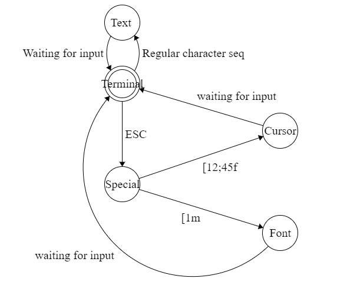

# Theory of Computation Sprint Challenge

## State Machines

> A useful tool for drawing state machines is [Evan's FSM
> Designer](http://madebyevan.com/fsm/).

- The VT-100 terminal (console) outputs text to the screen as it
  receives it over the wire. One exception is that when it receives an
  ESC character (ASCII 27), it goes into a special mode where it looks
  for commands to change its behavior. For example:

      ESC[12;45f

  moves the cursor to line 12, column 45.

      ESC[1m

  changes the font to bold.

  - Draw a state machine diagram for a VT-100 that can consume regular
    character sequences as well as the two above ESC sequences.

> If you're curious, [here are all the VT-100 escape
> sequences](http://ascii-table.com/ansi-escape-sequences-vt-100.php).
> More common these days is a superset of VT-100 called [ANSI escape
> sequences](http://ascii-table.com/ansi-escape-sequences.php). If
> you've ever put colors and stuff in your Bash prompt, this is what you
> used to do it.
>
> One of your instructors was once hired to implement VT-100 emulation
> in an app, and they used a state machine to do it.



## Computation

Fill out truth tables for the following expressions:

1. `(A ∧ ¬B)` (alternate: `(A && !B)`)

```
A     B     result
-------------------
0     0       0
0     1       0
1     0       1
1     1       0
```

2. `(¬A ∨ B) ∧ ¬(A ∧ ¬B)` (alternate: `(!A || B) && !(A && !B)`)

```
A     B     result
-------------------
0     0       1
0     1       1
1     0       0
1     1       1
```

3. `¬(A ∧ B) ∨ ( (A ∧ C) ∧ ¬(B ∨ ¬C) )` (alternate: `!(A && B) || ( (A && C) && !(B || !C) )`)

- (Hint: Is it possible to calculate this using code?)

```
A     B     C     result
-------------------------
0     0     0       1
0     0     1       1
0     1     0       1
0     1     1       1
1     0     0       1
1     0     1       1
1     1     0       0
1     1     1       0
```

## STRETCH GOAL

The sum of two binary digits can be represented with the following truth table:

- A + B

```
A     B     CARRY   SUM
------------------------
0     0       0      0
0     1       0      1
1     0       0      1
1     1       1      0
```

This can be represented with boolean algebra like so:

- `SUM = A ⊕ B` (alternate: `A ^ B` or `A xor B`)
- `CARRY = A ∧ B` (alternate: `A && B`)

How can you represent the SUM and CARRY of adding THREE digits with a truth table and in boolean algebra?

- A + B + C

```
A     B     C      carry   sum
--------------------------------
0     0     0        0      0
0     0     1        0      1
0     1     0        0      1
0     1     1        1      0
1     0     0        0      1
1     0     1        1      0
1     1     0        1      0
1     1     1        1      1
```

- SUM = A ^ (B ^ C)
  - Makes sure that there are odd number of 1s
- CARRY = A && B || (B && C || A && C)
  - Makes sure that there are more than 2 1s
